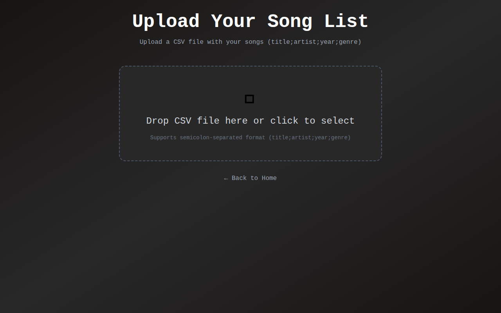
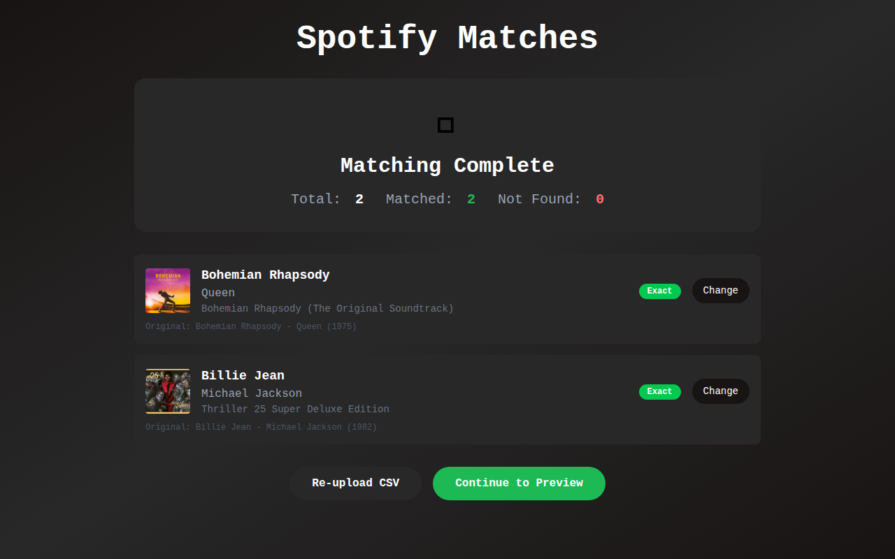
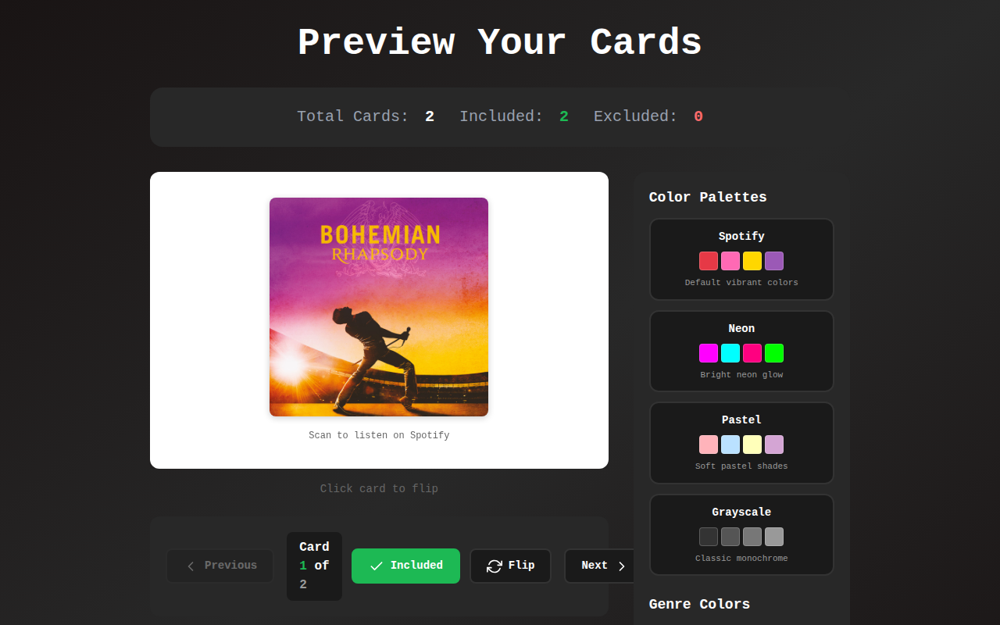
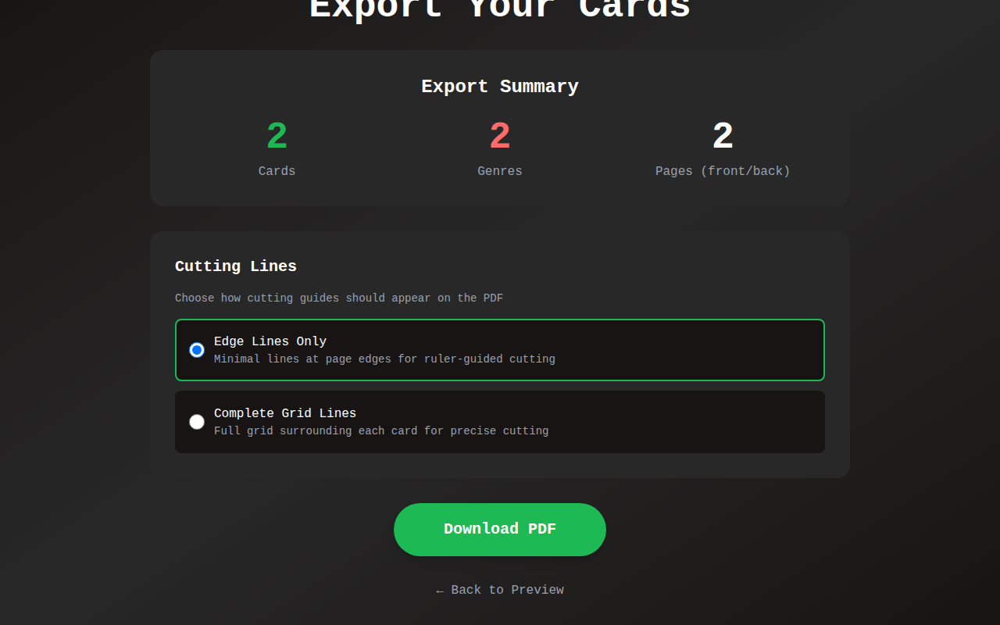

# 🎵 Hitster Card Generator

**Generate printable QR code cards for your custom Hitster music game**

[](https://github.com/SixFive7/HitsterCardGenerator/actions/workflows/release.yml)
[](https://opensource.org/licenses/MIT)
[](https://ghcr.io/sixfive7/histercardgenerator)

Upload a CSV of songs, match them to Spotify tracks, customize your card colors, and export a PDF ready for printing and cutting. Perfect for creating custom Hitster decks with your favorite music!

---

## Quick Start

```bash
docker run -d \
  -p 8080:8080 \
  -e TZ=Europe/Amsterdam \
  -e PUID=1000 \
  -e PGID=1000 \
  -e SPOTIFY_CLIENT_ID=your_client_id \
  -e SPOTIFY_CLIENT_SECRET=your_client_secret \
  ghcr.io/sixfive7/histercardgenerator:latest
```

Then open http://localhost:8080 in your browser.

> **Need Spotify credentials?** Create an app at [developer.spotify.com/dashboard](https://developer.spotify.com/dashboard) to get your Client ID and Secret.

---

## Screenshots

| Upload | Match |
|--------|-------|
|  |  |

| Preview | Export |
|---------|--------|
|  |  |

---

## Deployment

### Simple Setup (Direct Port)

The quickest way to get running. Exposes the app on port 8080.

```yaml
# docker-compose.yml
services:
  hitster:
    image: ghcr.io/sixfive7/histercardgenerator:latest
    container_name: hitster
    restart: unless-stopped
    ports:
      - "8080:8080"              # Access at http://localhost:8080
    environment:
      TZ: Europe/Amsterdam
      PUID: 1000
      PGID: 1000
      SPOTIFY_CLIENT_ID: your_client_id_here
      SPOTIFY_CLIENT_SECRET: your_client_secret_here
```

```bash
docker compose up -d
```

### Traefik Setup (Reverse Proxy)

For production with SSL. No port exposure - Traefik handles routing.

```yaml
# docker-compose.yml
services:
  hitster:
    image: ghcr.io/sixfive7/histercardgenerator:latest
    container_name: hitster
    restart: unless-stopped
    environment:
      TZ: Europe/Amsterdam
      PUID: 1000
      PGID: 1000
      SPOTIFY_CLIENT_ID: your_client_id_here
      SPOTIFY_CLIENT_SECRET: your_client_secret_here
    labels:
      traefik.enable: true
      traefik.http.routers.hitster.rule: Host(`hitster.yourdomain.com`)
      traefik.http.services.hitster.loadbalancer.server.port: 8080
```

> **Multi-architecture support:** The image supports both AMD64 (Intel/AMD) and ARM64 (Apple Silicon, Raspberry Pi).

---

## Environment Variables

| Variable | Required | Default | Description |
|----------|----------|---------|-------------|
| `SPOTIFY_CLIENT_ID` | Yes | - | Your Spotify API client ID |
| `SPOTIFY_CLIENT_SECRET` | Yes | - | Your Spotify API client secret |
| `TZ` | No | `Europe/Amsterdam` | Container timezone |
| `PUID` | No | `1000` | User ID for file ownership |
| `PGID` | No | `1000` | Group ID for file ownership |

Get your Spotify credentials from the [Spotify Developer Dashboard](https://developer.spotify.com/dashboard). Create an app, and you'll find the Client ID and Secret in the app settings.

> **Unraid users:** Set `PUID=99` and `PGID=100` to match the default nobody/users permissions.

---

## Developer Guide

### Architecture

```
┌─────────────────────────────────────────────────────────┐
│                      Web Browser                         │
│            (Svelte 5 + Tailwind CSS v4)                 │
└─────────────────────────┬───────────────────────────────┘
                          │ HTTP/REST
┌─────────────────────────▼───────────────────────────────┐
│                  .NET 10 Minimal API                     │
│  ┌──────────────┐  ┌─────────────┐  ┌────────────────┐  │
│  │ CSV Parsing  │  │  Spotify    │  │  PDF Export    │  │
│  │              │  │  Matching   │  │  (QuestPDF)    │  │
│  └──────────────┘  └──────┬──────┘  └───────┬────────┘  │
│                           │                 │           │
│                           ▼                 ▼           │
│                    SpotifyAPI.Web      QRCoder          │
└─────────────────────────────────────────────────────────┘
```

### Tech Stack

| Component | Technology |
|-----------|------------|
| Backend | .NET 10 Minimal API |
| Frontend | Svelte 5 + Tailwind CSS v4 (Vite) |
| PDF Generation | QuestPDF |
| QR Codes | QRCoder |
| Spotify Integration | SpotifyAPI.Web |

### Local Development

**Prerequisites:**
- .NET 10 SDK
- Node.js 18+
- Spotify API credentials

**Quick Start:**

```bash
# Clone the repo
git clone https://github.com/SixFive7/HitsterCardGenerator.git
cd HitsterCardGenerator

# Set up environment (create .env or export)
export SPOTIFY_CLIENT_ID=your_client_id
export SPOTIFY_CLIENT_SECRET=your_client_secret

# Run backend (serves frontend in production mode)
cd HitsterCardGenerator
dotnet run
```

**With Hot Reload (Frontend Development):**

```bash
# Terminal 1: Backend
cd HitsterCardGenerator
dotnet run

# Terminal 2: Frontend with HMR
cd HitsterCardGenerator/web
npm install
npm run dev
```

Then open http://localhost:5173 for the Vite dev server.

**Using DevContainer:**

The project includes a devcontainer configuration. Open in VS Code with the Dev Containers extension, and everything is pre-configured.

---

## License

[MIT](LICENSE) - Feel free to use this for your own Hitster game nights!
